# **Red Social**
## **Mexican Food Lovers**
### **The biggest Mexican Food Lovers Community**
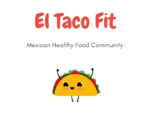

Una red social, para encontrar y compartir recetas y lugares de comida mexicana.

### **Proceso de UX**

La gastronomia mexicana esta catalogada como una de las más ricas en cuanto a sabores, colores y texturas en el mundo culinario. La mezcla de ingradientes, con la tipica base de productos deribados del maiz, condimentos picantes y exoticos, verduras y cualquier tipo de carne, dan como resultado una explosión de sabores deliciosos que ya son caracteristica de nuestra cultura.
Pero un gran sabor no es la unica caracteristica de la comida de México, pues está es catalogada como poco sludable e inclusive incomible para personas que no la acostumbran comer.

### **Descubrimiento e investigación**
__Encuestas__
Se realizaron un par de encuestas para definir mejor las nececidades de nuestrxs usuarixs potenciales.
Estas son las graficas iniciales.

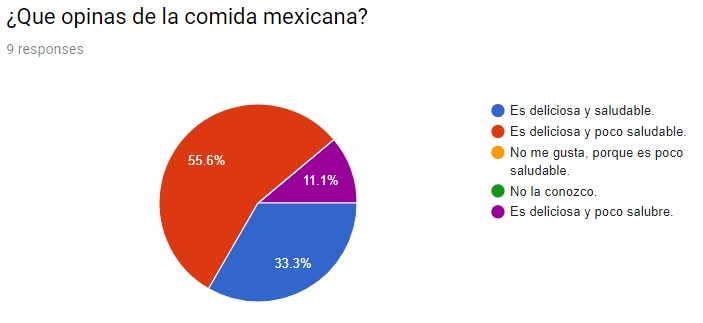
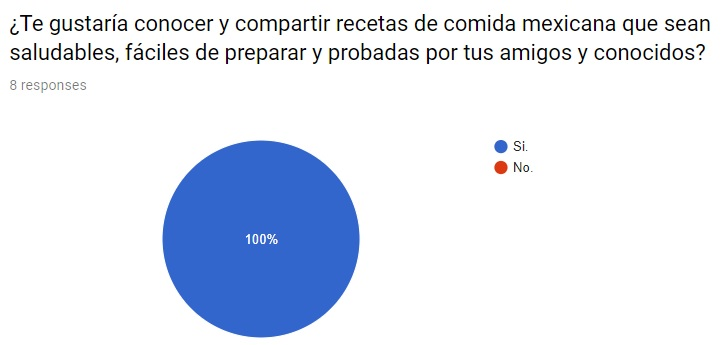
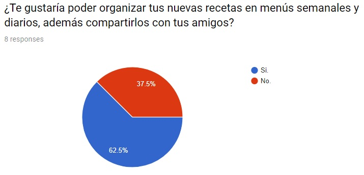
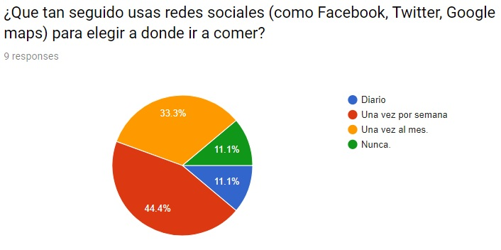

Las siguientes encuestas mostraron una tendencia hacia los mismos resultados.

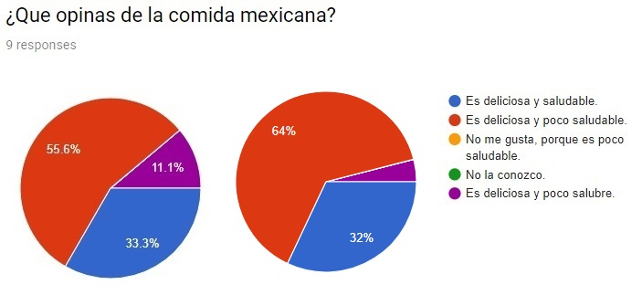
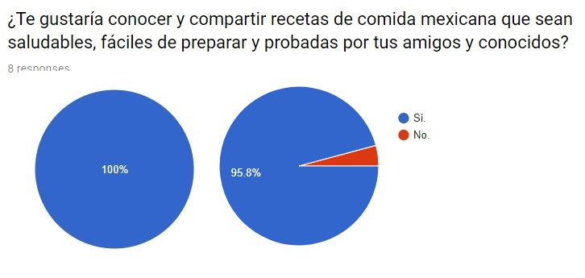

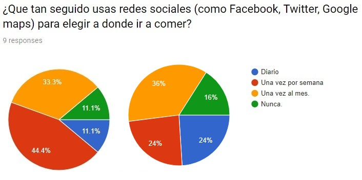

__Demanda de Mercado para la Comida:__

Hoy en día una moda que esta creciendo es el tener interes en conocer de dónde vienen los ingredientes que tienen los platillos que consumimos a la vez que buscamos consumir lo más productos de origen locales. Un ejemplo de ello es lo que esta pasando con la comida mexicana.
El año pasado, situaciones políticas y fenómenos naturales, hicieron a los mexicanos voltear al comercio y productores locales, a poner mayor atención en el origen de lo que se llevan a la boca, lo que ha hecho que los restaurantes representantes de esta rica gastronimia esten volviendo a las raíces tradicionales dandole un golpe de modernidad.

Los siguientes datos nos ayudan a ver mejor esta tendencia.
* La gastronimia Méxicana esta catalogada como Patrimonio Cultural de la Humanidad.
* En 2017, en el evento Latin American 50 Best Restaurant chefs de talla mundial se dieron cita para galardonar a los mejores restaurantes de Latinoamerica. __México es el país con más representantes de la lista, con 13 restaurantes__.
* Resurgimiento de mercados, como lugares Trendy en redes sociales:
Sitios como:
    * Milán 44, en la Ciudad de México; 
    * Mercado del Carmen, en San Miguel de Allende; 
    * PIKI Market, en Cholula;Alhóndiga Reforma, en Oaxaca; 
    * Mercado México, en Guadalajara;
    * Santiago, en Querétaro.
* Basado en una encuesta del portal de reserva de alojamiento Booking, una de las tendencias para el 2018 en cuanto a gastronomía será viajar para probar la comida callejera de cada destino (en México).
* A abril de 2017 había 59 mil 800 establecimientos de comida mexicana en todo Estados Unidos, siete por ciento más que en 2014; volviendose el segundo tipo de comida más popular en ese país.

__Perfil de Usuarix:__  

* Usuarixs Amantes de la comida mexicana.
    * Nacionalidad: Indistinta.
    * Edad: Joven entre 20 y 45 años.
    * Genero: Indistinto.
    * Nivel Socioecónimico: Deseable que sea laboralmente activo y con capacidad de consumir en locales recomendados.
    * Cuenta con un dispositivo para navegar en la web.    
    * Extenso uso de redes sociales.
    * Cuenta con conocimientos de cocina mexicana y el gusto por compartir sus conocimientos a cambio de likes.
    * Por sircunstancias, cuenta con poco tiempo y/o ingenio para mejorar sus propias recetas o buscar lugares donde disfrutar de la gastronimia mexicana.

    _Historias de Usuarix:_

    * Yo usuarix quiero encontrar de manera organica o directa una red social de comida mexicana, para compartir con mis amigos mi pasión por esta comida.
    * Yo usuarix quiero registrarme con mi email o mi cuenta de facebook, para tener una cuenta.
    * Yo usuarix quiero accder con mi usuario y contraseña personales, para tener privacidad.
    * Yo usuario quiero ver en pantalla mi nombre de usuario y mi foto de perfil, para identificarme como miembro de la comunidad.
    * Yo usuarix quiero leer en mi timeline sobre las nuevas recetas y los nuevos lugares que a posteado la comunidad.
    * Yo usuarix quiero poder valorar el contenido de los post (recetas y recomendaciones de lugares) en mi timeline, para ayudar a la comunidad a mejorar el contenido.
    * Yo usuarix quiero compartir mis recetas y recomendaciones de lugares para que sea leida y valorada por lxs otrxs miembrxs de la comunidad.
    * Yo usiarx quiero valorar y ser valorado por la comunidad, para lograr tener un alto status dentro de la red social.

__Necesidades de lxs usuarixs:__  
* Comunidad para encontrar, guardar y valorar recetas de origen mexicano.
* Comunidad para compartir tus propias recetas de origen mexicano.
* Comunidad para encontrar, guardar y valorar locales de comida mexicana.
* Comunidad para compartir recomendaciones sobre lugares de comida mexicana.

__Objetivos de lxs usuarixs:__
* Crecer sus conocimientos sobre ingredientes, formas y lugares para disfrutar en comunidad de la pasión por la gastronomia mexicana.
* Ganar el reconocimiento por parte de una comunidad de amantes de la gastronomia mexicana.

### **Síntesis y definición**

Nuestra propuesta se trata de una red social de gente experta y amateurs en el tema de la gastronomia mexicana, ayudandose mutuamente a mejorar sus recetas de platillos mexicanos; con el fin de hacer de la mismas una mejor opción para gustar a todos los paladares. Ademas de compartir sus experiencias consumiendo en locales que se dedican a preparar estos alimentos.

__Primer Sketch (baja fidelidad)__

Nuestro primer bosquejo:
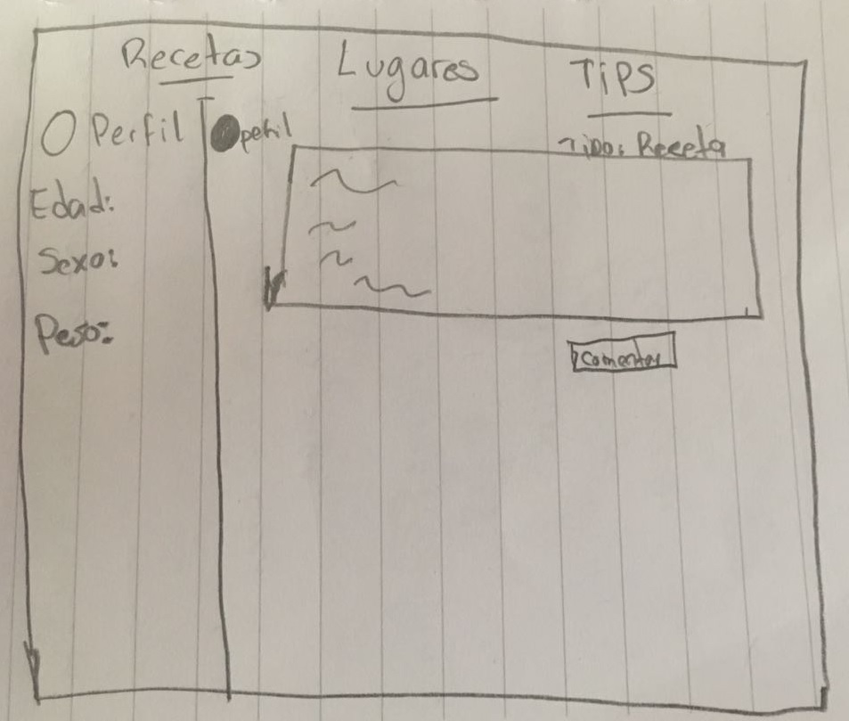

__Prototipo (Alta fidelidad)__

Esta fue nuestra primera propuesta.

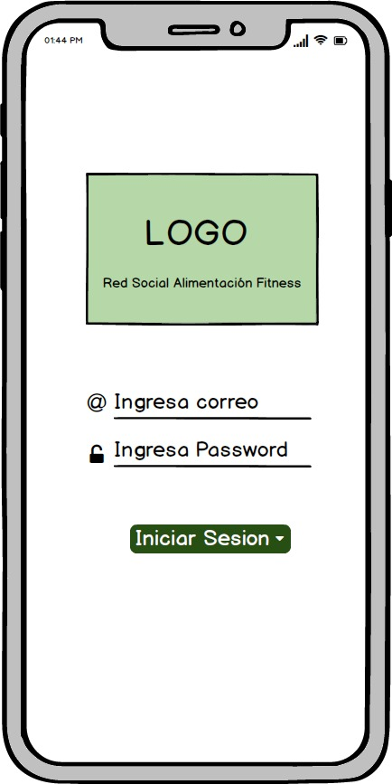

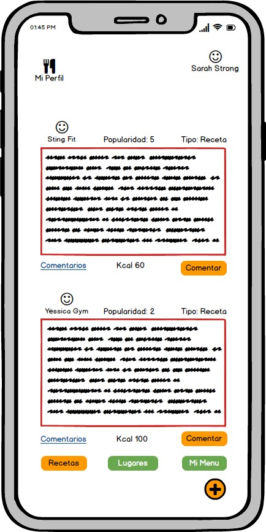

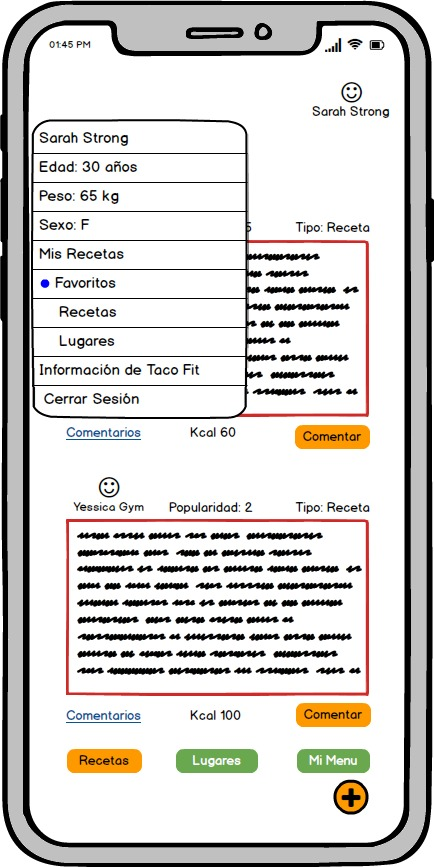

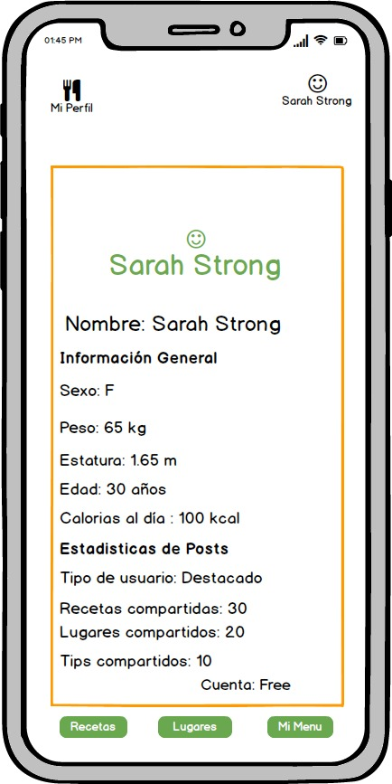

Despues de la primera entrevista con el inversionista, nuestra propuesta, que iba más orientada a comida saludable, cambio y este es el prototipo que surgio de las nuevas ideas:
[Segundo Prototipo de Alta Fidelidad](https://marvelapp.com/183635ig).

__Tipografía y Paleta de Colores__

La tipografía elegida para este proyecto fue tomada de la pagina de Google Fonts:  [Dosis](https://fonts.google.com/specimen/Dosis),
Consideramos que estetica y limpia sin llegar a la formaidad que no queremos transmitir en nuestra red social.

La paleta de colores elegida es la siguiente:

__Entrevista con Inversionista__

En entrevista con nuestro inversionista, en la cual se mostro el primer objetivo "Darle una nueva cara saludable a la comida mexicana", y un primer prototipo, el cual tenia incluida una version premium, se llegaron a las siguientes conslusiones:
* Al ser una red social encaminada a crear y hacer crecer una comunidad, la idea detener una versión de costo no era viable en primera instancia.
* La idea de una Red Social sobre comida mexicana esta bien encaminada, pero mal ejecutada al intentar abordar la idea desde el aspecto "Fitness".
* Dado el punto anterior, se nos hizo la recomendación de ampliar nuestro nicho y hacer más amplio nuestro perfil de usuarix.

Tras la entrevista se concluyeron los siguientes objetivos y motivaciones:

_Objetivos del negocio_

* Ofrecer a lxs usuarixs una red social de apoyo, para mejorar la experiencia de los usuarios que gustan de comer platillos de origen mexicano, desde de una receta para hacer en casa, hasta post de lugares que recomiendan visitar.

* Una base de datos que se alimenta en comunidad.
* Opción de comentar, dar valoración a cada post (recetas o sugerencias de lugares).
* Poder guardar tus favoritos (Lugares y Recetas) en tu perfil.
* Con la posibilidad de hacer amigos dentro de la red social.

_Motivaciones del negocio:_

* No encontrar una red social que te ayude a mejorar "especificamente tus" recetas de comida mexicana, para hacerlas más sanas y fitness.
* Mejorar la fama que tiene la comida mexicana, hacerla no solo deliciosa, si no támbien sana.
* Hacer una comunidad de gente mexicana y extrangera que quiera experimentar con la gastronomia mexicana.

__Benchmark__

Se hizo el analisis comparativo con las siguientes paginas y apliaciones que cuentan con funcionalidades en comun con nuestro proyecto de red social:
* Kiwilimon.
* Hatcook.
* Tastemade.
* REcetas Vegetarianas.
* Lifesum.
* Nestle.
* Recetas Mexicanas.

Nuestro [Benchmark](https://onedrive.live.com/view.aspx?resid=69D0F4BAC90868C1!209&ithint=file%2cxlsx&app=Excel&authkey=!ABbRAD6R-RVv2do) nos ha servido para ver las areas de oportunidad en las que se convertiran en la competencia de nuestra red social.

